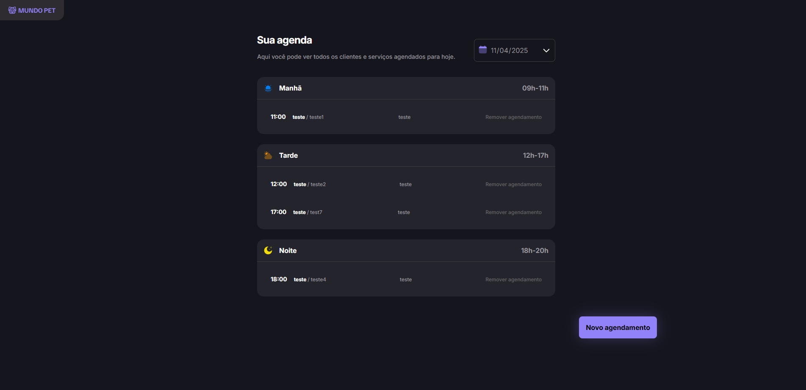

<h1> 🚀 Desafio prático - Agendamento - Mundo Pet</h1>

  

## 🚀 Tecnologias

Esse projeto foi desenvolvido utilizando as seguintes tecnologias:

- HTML: Estruturação do conteúdo da página.
- CSS: Estilização e design responsivo.
- JavaScript: Funcionalidades interativas para o agendamento.
- Git e GitHub: Controle de versão e hospedagem do código.
- Figma: Design e prototipação da interface.

## 💥 Funcionalidades

- **Adicionar** um novo agendamento
- **Visualizar** os agendamentos separados por período (manhã, tarde e noite)
- **Excluir** um agendamento
- **Filtrar** os agendamentos por data.

## 💻 Projeto

O **Mundo Pet** é uma aplicação web voltada para o agendamento de serviços em um PetShop, permitindo que usuários adicionem, visualizem, filtrem e excluam agendamentos de forma prática e organizada.

Este projeto foi criado como parte de um desafio prático do módulo de JavaScript antes do framework do curso Fullstack da Rocketseat.

Fui responsável por todo o desenvolvimento da aplicação, desde a estruturação com HTML e CSS, até a implementação das funcionalidades com JavaScript puro, colocando em prática todos os conhecimentos adquiridos ao longo do curso.

Além disso, criei uma API fake para simular as requisições e tornar a experiência mais próxima de um ambiente real de desenvolvimento.

## 🌟 Rodar o Servidor e o Projeto

Para rodar o projeto, você precisa executar dois comandos:

Em um terminal, execute o comando para rodar o servidor de desenvolvimento: 

- npm run server

Em outro terminal, execute o comando para rodar o projeto: 

- npm run dev

O primeiro comando irá iniciar um servidor para armazenar os agendamentos, e o segundo comando iniciará a aplicação no seu navegador.
